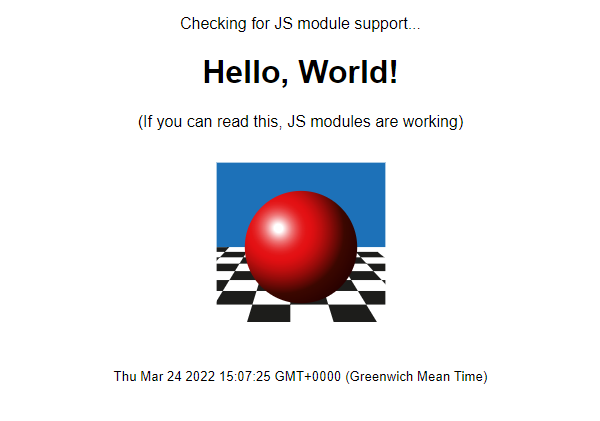

In this workshop, we're going to build a ray-tracer -- a program that renders photorealistic 3D scenes, directly in your web browser. Along the way, we're going to learn about a bunch of cool web technologies, like the HTML `<canvas>` element, ECMAScript modules, and JavaScript background workers.

In this module, we'll create the basic structure of our web application and look at how to run it on a local machine.

### Hosting your application: spark, vite, or something else?

To run the examples in this workshop, you need to run an actual web server on your local machine.

> _You can't use file:/// URLs because we're using ECMAScript modules, which need to be served via HTTP with the correct Content-Type header otherwise the browser will refuse to load them._

### Option 1: Use vite

If you already have a JavaScript environment that includes `npm`, `yarn`, or `pnpm` installed, I recommend you use **Vite**. Vite ([https://vitejs.dev](https://vitejs.dev)) is a JavaScript build tool which includes a local development server that provides "rich feature enhancements over native ES modules, for example extremely fast Hot Module Replacement".

> _Hot Module Replacement means that whenever you save a file in your editor, it'll automatically reload that module, and any dependent modules, in your browser. It makes for a wonderfully fast feedback look, particularly if you've got a browser open on a second screen so you can see your changes immediately without even having to switch windows._

These instructions use the `yarn` package manager; if you're using `npm` or `pnpm`, check out the documentation at [https://vitejs.dev/guide/#scaffolding-your-first-vite-project](https://vitejs.dev/guide/#scaffolding-your-first-vite-project) to see how to scaffold your project.

```bash
yarn create vite radiance --template vanilla
cd radiance
yarn
yarn dev
```

Running `yarn dev` should produce:

```bash
vite v2.8.6 dev server running at:

> Local: http://localhost:3000/
> Network: use `--host` to expose

ready in 171ms.
```

and if you point a browser at http://localhost:3000/, you should see the "**Hello Vite!**" message.

Next, we're going to replace the default Vite template files with our own versions.

Downloadd [examples/01-hello-world.zip](examples/01-hello-world.zip) and unzip it into the `radiance` directory (say "yes" if it prompts you to overwrite the existing files.)

Now, when you run `yarn dev`, you should see this:



### Option 2: use rif/spark

[rif/spark](https://github.com/rif/spark/releases) describes itself as an "emergency web server". It's a tiny standalone application that will turn any directory on your system into a web server, and it's ideal for testing client-side web apps if you don't have, or don't want, a JavaScript development server.

1. Create a project folder called `radiance`.
2. Download the Spark binary for your system from [https://github.com/rif/spark/releases](https://github.com/rif/spark/releases) into your `radiance` directory.
3. Download [examples/01-hello-world.zip](examples/01-hello-world.zip) and unzip it into the `radiance` directory.

You should end up with this folder structure:

```bash
/radiance
  - index.html
  - main.js
  - greeter.js
  - style.css
  - favicon.ico
  - spark
```

Now if you run `spark` from a terminal window, it'll open a web server (by default on [http://localhost:8080/](http://localhost:8080/)); opening this link in a browser should show you the Hello, World screen above.

> _If you're running spark on Windows 10 or 11 and you get an error about incorrect MIME types, check your Windows registry to ensure that .js files are registered with the correct type. Open `regedit` as an administrator, find the key `Computer\HKEY_CLASSES_ROOT\.js`, and check that the `Content Type` entry has the value `text/javascript`._

### Option 3: use something else

If you've already got a local web server running, feel free to use that - as long as it serves `.js` files with the correct `Content-Type: text/javascript` HTTP header, it'll work just fine.

## Review & Recap

- Our web application uses a combination of HTML files, JavaScript files, and stylesheet (CSS) files.
- **rif/spark** is a tiny standalone web server we can use to host our web applications
- We can also host our web applications using a development server like Vite
