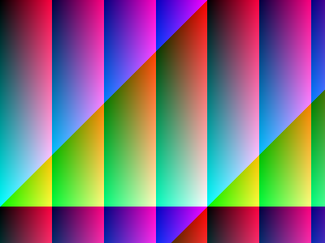
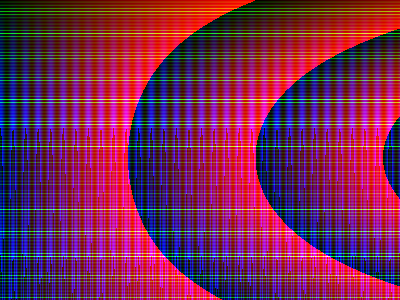
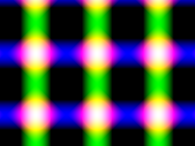

In the last module, we used the HTML canvas element to draw a Piet Mondrian canvas. Drawing individual rectangles by hand is kinda cool, but things don't get really exciting until we start using JS code to calculate the colors of the pixels we're drawing. 

To do this, we're going to use a function called a **pixel shader**: we give it a pixel, it tells us what colour that pixel should be. Here's a shader function which will draw a chessboard pattern. Based on the tile size, we work out whether this pixel is in an odd-numbered or an even-numbered row and column:

```javascript
(x, y) => {
    const xOdd = (x % (2 * size) < size);
    const yOdd = (y % (2 * size) < size);
    return (xOdd != yOdd ? color1 : color2);
}
```


**Try it live: [examples/02-canvas/index.html](examples/02-canvas/index.html)**

We can also calculate individual red, green, and blue pixel values based on the x/y coordinates passed into the function.

```javascript
(x, y) => {
  let r = (4 * x) % 256
  let g = (x + y) % 256
  let b = y % 256
  return `rgb(${r},${b},${g})`
}
```

You should get an image something like this:



**Try it live: [examples/02-canvas/index.html](examples/02-canvas/index.html)**

## The Renderer

Our procedural rendering system has three main components:

* The `main.js` module, which defines our painting method (the thing which actually paints the pixels), and our user interface code.
* The `patterns.js` module, which defines our shader functions
* The `renderer.js` module, which contains the `Renderer` class

The `Renderer` calls our shader function one for each pixel in our canvas, and then passes the resulting color to a **callback function**, defined in our `main.js` module.

The `render` method takes three arguments: the pixel shader function we want to use, the callback function to call for each rendered pixel, and a `step` parameter. 

The `step` parameter gives us a way to run fast preview renders, which will prove useful as our rendering code gets slower and more complex. If we specify `step = 4`, we'll render 4x4 blocks of pixels as a single colour, instead of rendering each pixel individually, speeding up our render by a factor of 16.

Here's the Gradiance shader rendered with `step=1`


Here's the Gradiance shader rendered with `step=4`


And here's the Gradiance shader rendered with `step=10`:


## Exercise: Procedural Patterns

Download the code for this section from [examples/02-canvas.zip](examples/02-canvas.zip)

Add a new pattern to `modules/patterns.js`:

1. Add a new `export function MyPattern` to `modules/patterns.js`, 
2. Come up with a new method for translating the `x,y` coordinates into `r,g,b` color values - there's some suggestions below
3. Add a new `option` to the `select` list in `index.html`, and a corresponding `case` to the `switch` in `main.js`.


Here's a couple of fun things to try:

- The modulus operator in JavaScript is `%`, so an expression like `x % 256` will always give you a value between 0 and 255 - useful for constructing valid RGB colors where each of the red, green, and blue values has be between 0 and 255.
- You can also write `256` as `0xff`, which might look more natural if you're used to HTML hex color values.
- `Math.abs(x)` will give you the absolute value (i.e. always positive) of `x`
- The trigonometry functions `Math.sin(x)` and `Math.cos(x)` will give you a value between -1 and +1; try multiplying this by the `x` or `y` values

Here's a few more examples:

#### Supernova

```javascript
(x, y) => {
  let r = (x * (1 + Math.sin(y / 100))) % 255 // 4*x % 255;
  let g = Math.abs(20 * Math.tan(y)) % 255
  let b = (y * (1 + Math.cos(x / 2))) % 255 // (x+y) % 255;
  return `rgb(${r},${g},${b})`
}
```



#### Lasergrid

```javascript
(x, y) => {
  let r = 255 * Math.sin(200 - x / 20) + 255 * Math.cos(150 - y / 20)
  let g = 255 * Math.sin(200 - x / 20)
  let b = 255 * Math.cos(150 - y / 20)
  return `rgb(${r},${g},${b})`
}
```


