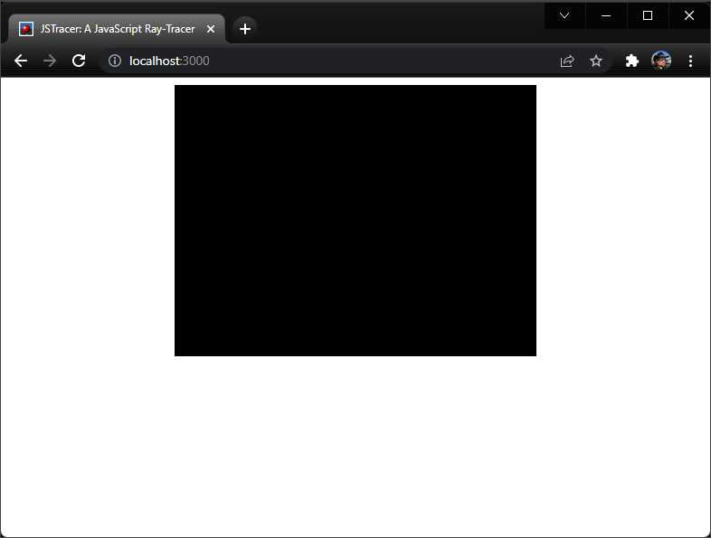
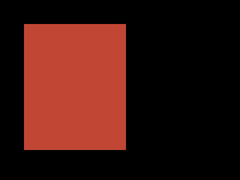
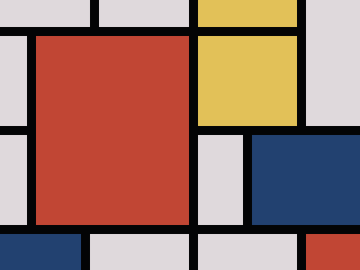
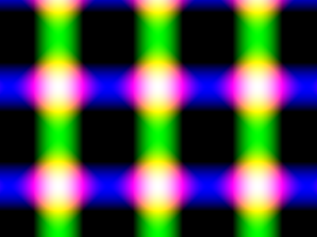

Back in the early days of the web, you'd occasionally see sites that created images using thousands of 1x1-pixel `div` or `span` elements, with each element assigned a different `background-color` to simulate individual pixels.

Fortunately, modern browsers support an HTML element called `canvas`, standardized in 2006, which gives us a much finer degree of control when it comes to drawing lines, shapes and images in browser-based web applications. In this module, we'll add a `canvas` element to our application, along with some simple JavaScript code that'll demonstrate how to render graphics onto our canvas.

Open `index.html` and update the `body` element so it looks like this:

```html
<body>
  <canvas id="my-canvas" width="400" height="300"></canvas>
  <script type="module" src="./main.js"></script>
</body>
```

Next, add a CSS rule to `style.css` that sets the canvas' background color to black:

```css
canvas {
  background-color: #000;
}
```

You should now see a blank page with an empty black canvas on it:



## Drawing graphics onto a canvas

Now we're going to add some JavaScript code to demonstrate how to draw graphics onto the canvas.

Open `main.js`, delete the existing code, and replace it with this:

```javascript
let myCanvas = document.getElementById('my-canvas')
let ctx = myCanvas.getContext('2d');
ctx.fillStyle = '#C14634';
ctx.fillRect(40, 40, 170, 210);
```

If you're using vite, the page will reload automatically. If you're using Spark, you'll need to refresh your browser. You should see this:



To draw more complex shapes, we can just call `fillRect` over and over again:

```javascript
let myCanvas = document.getElementById('my-canvas')
let ctx = myCanvas.getContext('2d');
ctx.fillStyle = 'rgb(3,4,5)';
ctx.fillRect(0, 0, 400, 300);
ctx.fillStyle = '#dfd9dc';
ctx.fillRect(0, 0, 100, 30);
ctx.fillRect(110, 0, 100, 30);
ctx.fillRect(0, 40, 30, 100);
ctx.fillRect(0, 150, 30, 100);
ctx.fillRect(220, 150, 50, 100);
ctx.fillRect(100, 260, 110, 100);
ctx.fillRect(220, 260, 110, 100);
ctx.fillRect(340, 0, 60, 140);
ctx.fillStyle = '#C14634';
ctx.fillRect(40, 40, 170, 210);
ctx.fillRect(340, 260, 170, 210);
ctx.fillStyle = '#E2C158';
ctx.fillRect(220, 0, 110, 30);
ctx.fillRect(220, 40, 110, 100);
ctx.fillStyle = '#224170';
ctx.fillRect(0, 260, 90, 40);
ctx.fillRect(280, 150, 120, 100);
```



**Try it live: [examples/02-canvas/mondrian.html](examples/02-canvas/mondrian.html)**

There we go... we're using JavaScript and the `<canvas>` element to create digital artworks inspired by [Piet Mondrian](https://en.wikipedia.org/wiki/Piet_Mondrian). Not bad.

In this example, we've introduced four new concepts:

1. We get a reference to the canvas using `document.getElementById` and specifying the `id` of our `canvas` element
2. We create a **graphics context** by calling `myCanvas.getContext('2d')`. The `'2d'` here specifies we're using a 2-dimensional canvas; some browsers now support built-in 3D graphics using the WebGL API, but in this workshop we'll be rendering 3D graphics onto a 2D canvas.
3. We're setting the context's **fill style** by specifying a color. Canvas graphics support all HTML color formats, including hex digits (`#123abc`), RGB values `rgb(0,127,255)`, and alpha transparency `rgba(63,127,255,0.5)`.
4. We're calling `ctx.fillRect(top, left, width, height)` to draw a filled rectangle using the current fill style.

## Procedural graphics

Drawing individual rectangles by hand is kinda cool, but things don't get really exciting until we start using JS code to calculate the colors of the pixels we're drawing. One of the simplest procedural patterns is a chessboard pattern.

Here's the `getColorAtPixel` function for drawing a chessboard pattern. Based on the tile size, we work out whether this pixel is in an odd-numbered or an even-numbered row and column:

```javascript
(x, y) => {
    const xOdd = (x % (2 * size) < size);
    const yOdd = (y % (2 * size) < size);
    return (xOdd != yOdd ? color1 : color2);
}
```


**Try it live: [examples/02-canvas/index.html#chessboard](examples/02-canvas/index.html#chessboard)**

We can also calculate individual red, green, and blue pixel values based on the x/y coordinates passed into the function.

```javascript
(x, y) => {
  let r = (4 * x) % 256
  let g = (x + y) % 256
  let b = y % 256
  return `rgb(${r},${b},${g})`
}
```

You should get an image something like this:


**Try it live: [examples/02-canvas/index.html#gradiance](examples/02-canvas/index.html#gradiance)**

## Exercise: Procedural Patterns

Download the code for this section from [examples/02-canvas.zip](examples/02-canvas.zip)

Add a new pattern to `modules/patterns.js`:

1. Add a new `export function MyPattern` to `modules/patterns.js`, 

2. Come up with a new method for translating the `x,y` coordinates into `r,g,b` color values - there's some suggestions below

3. Add a new `case` to the `switch` statement in `main.js`:

   `case "#mypattern": Patterns.MyPattern(myCanvas); break;`

4. View your pattern by going to `index.html#mypattern`

Here's a couple of fun things to try:

- The modulus operator in JavaScript is `%`, so an expression like `x % 256` will always give you a value between 0 and 255 - useful for constructing valid RGB colors where each of the red, green, and blue values has be between 0 and 255.
- You can also write `256` as `0xff`, which might look more natural if you're used to HTML hex color values.
- `Math.abs(x)` will give you the absolute value (i.e. always positive) of `x`
- The trigonometry functions `Math.sin(x)` and `Math.cos(x)` will give you a value between -1 and +1; try multiplying this by the `x` or `y` values

Here's a few more examples:

### Supernova

Try it live: [examples/02-canvas/index.html#supernova](examples/02-canvas/index.html#supernova)

```javascript
(x, y) => {
  let r = (x * (1 + Math.sin(y / 100))) % 255 // 4*x % 255;
  let g = Math.abs(20 * Math.tan(y)) % 255
  let b = (y * (1 + Math.cos(x / 2))) % 255 // (x+y) % 255;
  return `rgb(${r},${g},${b})`
}
```


### Lasers

Try it live: [examples/02-canvas/index.html#lasers](examples/02-canvas/index.html#lasers)

```javascript
(x, y) => {
  let r = 255 * Math.sin(200 - x / 20) + 255 * Math.cos(150 - y / 20)
  let g = 255 * Math.sin(200 - x / 20)
  let b = 255 * Math.cos(150 - y / 20)
  return `rgb(${r},${g},${b})`
}
```



## The HTML Canvas: Review & Recap

- The `canvas` element and API give us a way to draw graphics using JavaScript
- To draw graphics, we need to get a **graphics context** for our canvas element.
- We control the color we're drawing by setting the context's`fillStyle` to an HTML color value.
- We can draw individual pixels by using the `fillRect` method and specifying a width and height of ` pixel.

## References and Further Reading

* The Canvas API: [https://developer.mozilla.org/en-US/docs/Web/API/Canvas_API](https://developer.mozilla.org/en-US/docs/Web/API/Canvas_API)
* HTML Colors reference at w3schools: [https://www.w3schools.com/html/html_colors.asp](https://www.w3schools.com/html/html_colors.asp)
