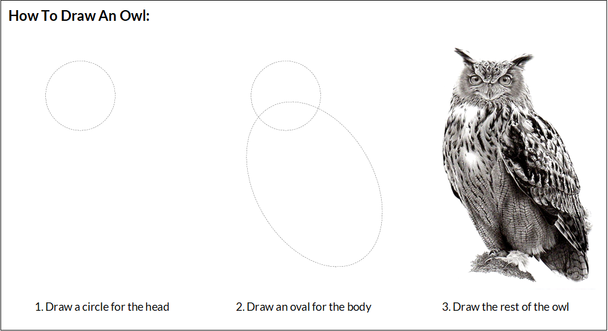

To start building a ray tracer, we need a system for modelling three-dimensional space.

Our next milestone is going to be rendering a completely empty scene with no shapes in it. To get there, we need to implement a lot of new things, and unfortunately there's no way to see any of it working until we've got it all plugged in and wired up, so this section might feel a little bit like step 3 of "how to to draw an owl" -- sorry!



We're also going to introduce some pretty complex mathematics. Here's the important part: **you don't need to understand *how* all the stuff here works; it's enough to know *what it does*.** 

We're going to model our world using a 3D coordinate system, based on something called a **vector**.  

A vector is a set of three values *x, y, z*.

> It's conventional to write vectors surrounded with angle brackets, like this: `<3,4,5>`
>
> We'll use this convention in the handbook, but in HTML, angle brackets are used to enclose tags, and in JavaScript, they're less than / greater than, so you won't see angle brackets used like this anywhere in the actual code.

The vector `<0,0,0>` is the **origin** - the centre of our universe. 

Assuming we are standing at the origin, looking in the positive-Z direction:

* The X-axis goes from left (negative) to right (positive)
* The Y-axis runs from underground (negative) towards the sky (positive)
* The Z-axis starts behind us (negative) and runs directly away from us (positive)

We're going to create a JavaScript **module** called `vector.js`, which exports a class called `Vector` that we can then import into the other bits of our project as needed. If you've worked with vectors before, you'll probably recognise things like the dot-product and cross-product. If not, don't worry; we'll explain what it all does as we go along:

```javascript
// modules/vector.js


```

Things to note here:

* The coordinate values `x,y,z` are stored using **private properties** `#x, #y, #z`. These are a relatively recent addition to JavaScript; any field prefixed with `#` is private, and can't be manipulated from outside the object. By using private properties, we can make our vectors **immutable** -- once a vector has been constructed, you can't change the `x,y,z` values of that vector. 

* New vectors are constructed by specifying the *x,y,z* coordinates of the vector: 

  `let v = new Vector(0,1,0)`

* Every vector has a **length** (also known as the *magnitude*). Because vectors are immutable, we calculate the length in the constructor and store it as part of the vector, since we know it can't change.

* A **unit vector** is a vector with a length of exactly 1 unit. The three most common unit vectors are defined as `static` properties on the `Vector` class:

  * `Vector.X` = `<1,0,0>`
  * `Vector.Y` = `<0,1,0>`
  * `Vector.Z` = `<0,0,1>`

  There's also a static vector for `<0,0,0>` called `O` - that's a letter `O`, not the number `0`:

  * `Vector.O` = `<0,0,0>`

`Vector` provides methods for various mathematical operations we'll need. (Again, don't worry too much about exactly what these do; we're here to draw pictures, not learn vector arithmetic.)

* `v1.dot(v2)` returns the **[dot product](https://en.wikipedia.org/wiki/Dot_product)** of vectors `v1` and `v2`
* `v1.cross(v2)` returns the **[cross product](https://en.wikipedia.org/wiki/Cross_product)** of vectors `v1` and `v2`
* `v1.invert()` returns a new vector which is the inverse vector of `v1`. 
  * The inverse of `<x,y,z>` is `<-x,-y,-z>`

* `v1.add(v2)` returns the **sum** of vectors `v1` and `v2`
  * The sum of a vector and its inverse is always `<0,0,0>`

* `v1.scale(factor)` scales the vector by the specified factor.
  * `v1.invert()` is equal to `v1.scale(-1)`


## Review & Recap

* Vectors representing three coordinates `x,y,z` in 3D space.
* A vector's `length` is the total distance from `<0,0,0>` to the point represented by that vector.
* Vectors can be multiplied, added, inverted, and scaled.
* Vectors are modelled as **immutable objects** - once we've created a vector, we can't change the `x`, `y`, or `z` coordinates. Vector transformation methods all return a new vector.

## References and Further Reading

* Private class fields in JavaScript: 

  [https://developer.mozilla.org/en-US/docs/Web/JavaScript/Reference/Classes/Private_class_fields](https://developer.mozilla.org/en-US/docs/Web/JavaScript/Reference/Classes/Private_class_fields)

