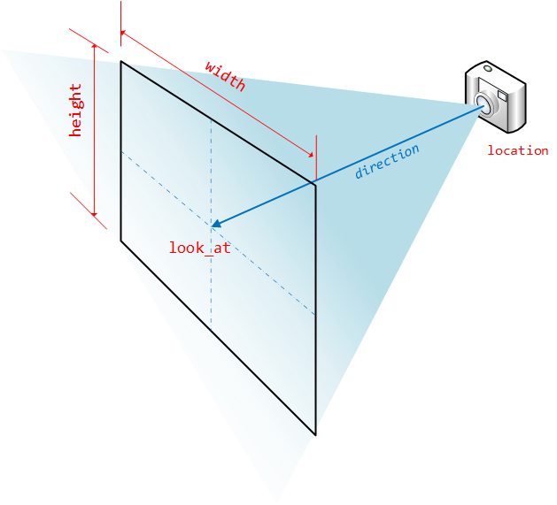

In this module, we'll introduce three more concepts, that should get us to the point where we can render an empty scene. *(Hey, we gotta start somewhere, right?)*

### The settings file and rendering thresholds

> *"JavaScript arithmetic is Wobbly. It's good arithmetic, but it Wobbles and the numbers get in the wrong places."*
>
> ​	-- Winnie the Pooh ([probably](https://en.wikiquote.org/wiki/Spelling)).

Ray-tracing uses lots of complex floating-point arithmetic, and floating-point arithmetic isn't exact. The best we can guarantee is a very, very close approximation. Try running this in a JavaScript console:

```javascript
> 0.1 + 0.2
< 0.30000000000000004

> (0.1 + 0.2) - 0.3 == 0
< false
```

To render a scene in our ray-tracer, we'll need to run hundreds of calculations checking whether various rays intersect with different shapes and surfaces; these are done using floating-point arithmetic, and we're often checking for a result that, in a perfect world, would equal zero. But as we've seen, we can't count on getting exact results from the JS arithmetic engine.

To work around this, we define a `THRESHOLD`.  Any value below `THRESHOLD` can be treated as zero, and two values whose difference is less than `THRESHOLD` can be treated as equal.

We'll set this in a new module called `settings.js`, so we can import it into any other module that needs to use it:

```javascript
// modules/settings.js


```

### Ray

Ray-tracers work by tracing rays -- modelling individual rays of light that bounce around our scene, interacting with shapes, lights and shadows.

In this module, we'll create the `Ray` class that we use to model one of these light rays.

Add a new file to your project called `modules/ray.js`, which looks like this:

```javascript
// modules/ray.js


```

A ray is defined by two properties:

* `start` - the starting point (where did the ray come from?)
* `direction` - which way is the ray pointing?

These properties are both vectors -- which might seem a little odd, but remember that a vector's `<x,y,z>` coordinates can represent a **point in space**, relative to the origin `<0,0,0>`, but they can also represent a **direction** - how far have we moved in each dimension of our coordinate system?

`Ray` also defines a method called `trace`, which traces the ray through a scene and tells us what color it ends up. 

We're going to give each scene a **background color**, which is the "default" color - any ray which doesn't hit an object will end up as the background color. And because we haven't implemented any shapes yet, all we can do for now is render the background color, which may not seem like much, but it's a significant step towards rendering actual scenes.

### Scene

Add a new file to your project called `modules/scene.js`, which looks like this:

```javascript
// modules/scene.js


```

For now, the only things in our scene are a camera, and a background color.

### Camera

Add a new file to your project called `modules/camera.js`, which looks like this:

```javascript
// modules/camera.js


```

We create a camera by specifying two vectors: 

* `location` - where the camera is located in our scene
* `look_at` - what is the camera pointing at?

There's some pretty complicated code in the `constructor` for the camera class; this takes the `location` and `look_at` vectors and calculates exactly what the camera can "see". By default, the camera is positioned by rotating it around the Y-axis until it's pointing toward the `look_at` point, and then angled up or down until it's pointing in the right direction.

> There's a tiny fudge in here, because if the camera is directly above the look_at point, trying to position it results in a divide-by-zero error, so if this happens we nudge the camera backwards along the Z-axis by a tiny amount -- we actually use the `THRESHOLD` amount defined earlier in `settings.js`

There are two additional arguments, `width` and `height`, which control the field of view of the camera.

Imagine holding a rectangular frame in front of your camera. We're going to render everything that's visible through the frame. The frame is `width` units wide and `height` units high, and centred at the`look_at` coordinate. If the camera `location` is close to the `look_at`, we get a very wide field of view (and shapes at the edges of our frame will appear more distorted). If the location is further away from the frame, we get a narrow field of view.



The `trace(scene,x,y)` method takes a scene, and the x- and y- coordinates of the point we're tracing; it works out what direction that ray will be going in, and then calls `ray.trace`

> The camera works in **world coordinates**, so X and Y here are a position on the "viewport" -- they are NOT the x/y pixel coordinates of our HTML canvas. 

## Review & Recap

* We've introduced a `THRESHOLD` setting, to work around inaccuracies caused by floating-point arithmetic.
* We've introduced a `Ray` class to model a single ray of light
* We've introduced a `Scene` class, to model the scene which we're rendering. At the moment, scenes are empty except for a background color.
* We've introduced `Camera`, which has a `location` and a `look_at` value, controlling where the camera is and which way it's pointing. *(OK, and also a bunch of complicated vector arithmetic to work out which way is 'up'...)*

