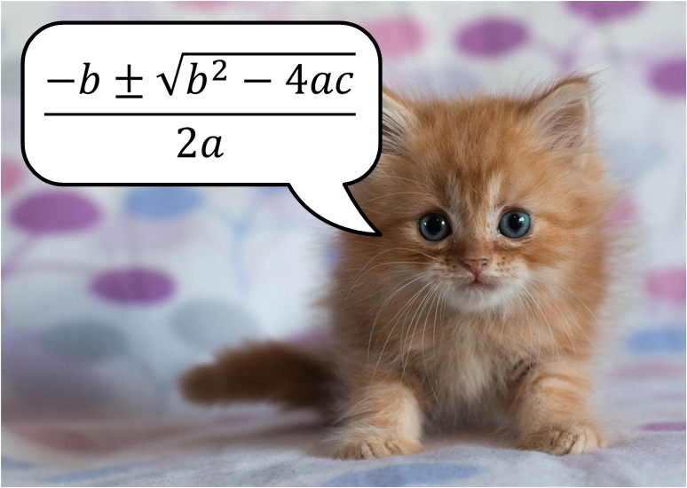

In section 3, we created a ray-tracing engine that can render empty scenes. Which doesn't sound like much, but along the way we've laid the foundations that'll make the next part of the workshop much more straightforward.

In this section, we'll add some coloured spheres to our tracer. For now, they'll appear as flat brightly-coloured discs -- this is fine; it'll let us test our shape intersection code before we start adding effects like shading and reflection in the next section.

We're going to create a base class called `Shape` - all the shapes we use in our scenes will extend `Shape`. Create a new file called `modules/shape.js` with this content:

```javascript
// modules/shape.js


```

For now, shapes in our world have only one responsibility: we can pass a ray of light into the shape and say "hey, does this ray intersect you anywhere?" -- and if it *does*, what's the distance from the start of the ray to the nearest intersection point?

> Because we know the starting point of every ray, and the direction it's pointing, if we know the distance along that ray where it intersects the shape, we can calculate the exact point in space where that ray intersects that shape.

### The sphere

The first shape we're going to add to our system is the **sphere**.

Here's the code: put this in `modules/shapes/sphere.js`:

```javascript
// modules/shapes/sphere.js


```

All the sphere actually needs to do is override the `findIntersections` method from the `Shape` base class, and provide the code that'll find intersections between a ray travelling through space, and the surface of a sphere. Each ray will intersect the sphere in zero, one, or two places.

The intersections here are the roots of a quadratic equation - the thing you probably learned in high school and though you'd never use again. Just in case you've forgotten, here's the Quadratic Formula Kitten to remind you:



So we do some arithmetic sleight-of-hand to turn our sphere into those three values a, b, c, then we plug the whole thing into the quadratic formula and see how many solutions we get.


The important bit is that it'll give us an array of **distances**. If the ray doesn't intersect the sphere, we get back an empty array. If the ray just grazes the surface of the sphere, we get a single intersection, and return a single distance; and if the ray goes through the sphere, we get two intersection points.

Now, we'll modify the `trace` method on our `Ray` object to look for these intersections:

```
trace = (scene) => {  
    let distanceToNearestShape = Infinity;
    let nearestIntersectingShape = null;
    scene.shapes.forEach(shape => {
        let distance = shape.closestDistanceAlongRay(this);
        if (distance < distanceToNearestShape) {
            distanceToNearestShape = distance;
            nearestIntersectingShape = shape;
        }
    });
    if (distanceToNearestShape == Infinity) return scene.background;
    let point = this.start.add(this.direction.scale(distanceToNearestShape));
    return nearestIntersectingShape.getColorAt(point, this.direction, scene);
}
```

### Adding shapes to a scene

When we create a `Scene`, we'll pass in an array of shapes. Modify `modules/scene.js` so it looks like this:

```javascript
// modules/scene.js


```

Now we'll modify `main.js` to create some spheres and add them to our scene:

```javascript
// main.js


```

If it worked? You'll get this - five coloured circles.


The important thing to notice here is that even though we're just rendering them as flat discs, our ray tracer is smart enough to know which bits we can see, and which bits are hidden behind another shape.
