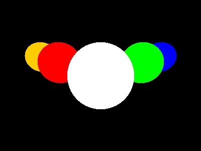
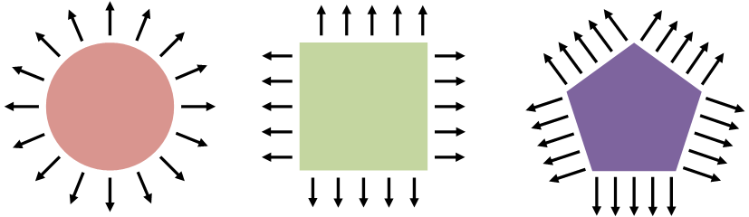
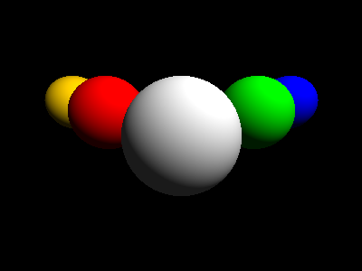

In the last section, we got as far as rendering spheres as flat discs:



The code that actually makes this happen is the `getColorAt` method in `shape.js`; at the moment, each of our spheres is a solid color, and `getColorAt` just returns the color of the nearest sphere to the camera, or the scene's background color if that particular pixel doesn't have any shapes in it.

In this section, we're going to add some lights to our scene, and write the code that'll calculate the realistic light and shade effect you get when a sphere is illuminated by a light source.

### Adding lights to our scene

Just like we did in with shapes in the last section, we're going to create a class to represent a light source, then pass an array of lights into our Scene before we render it.

Create a new file called `modules/light.js`:

```javascript
// modules/light.js


```

Lights in our world have a **location** and a **color**; to create a new light, we need to specify where it is, and what color it is.

* The brightest light we can have is pure white `(255,255,255)`, or `#ffffff`
* Lights in Radiance are invisible. They illuminate other objects, but they don't actually *appear* in the scene; if you point the camera directly at a light source, you won't see anything.

Now we'll modify our `Scene` class to accept an array of lights when we create a scene:

```javascript
// modules/scene.js


```

and update `main.js` to include a light when we set up our scene:

```javascript
// main.js


```

OK, now comes the fun part. We're going to modify `shape.js` to calculate just how bright the surface of a shape is, at any point in the scene, based on what light sources are falling on that shape and what angle they're striking it at.

Before we can do that, we need to introduce a new concept: something called a **normal**. For any point on the surface of a shape, the **normal** is the vector pointing directly away from the surface.



To calculate effects like shading and reflection, we need to know which direction the light ray came from, the point where that ray hits our shape, and the **angle between the light ray and the surface at that point** - and to do this last bit, we need to be able to calculate the normal vector at any point on a shape's surface.

So we'll add a method to `Shape` with a default implementation that returns the zero vector:

```javascript
/** Default implementation that we'll override for each shape */
getNormalAt = point => Vector.O;
```

and then override this in `Sphere` with the method that actually calculates the surface normal at any point on a sphere:

```javascript
/** Calculate the normal at any point on a sphere */
getNormalAt = point => point.add(this.center.invert()).normalize();
```

If you're curious about how it works, what we actually do here is calculate the vector between the point and the centre of sphere, and then **normalize** that to get a vector that's pointing in the same direction and is exactly 1 unit long. (All we care about with a normal is the direction; the magnitude of a normal vector isn't important.)

One more thing we need to do first: to calculate lights and shade, we need to be able to add, multiply, and scale colors. (Think about shining two different-coloured lights at the same spot on a white wall - the colour you actually see is created by adding together the colours of those two lights.)

Add these methods to the `Color` class in `modules\color.js`:

```javascript
add = (that) => new Color(this.r + that.r, this.g + that.g, this.b + that.b);

multiply = (that) => {
    let rr = Math.floor(this.r * that.r / 0xff);
    let gg = Math.floor(this.g * that.g / 0xff);
    let bb = Math.floor(this.b * that.b / 0xff);
    return new Color(rr, gg, bb);
}

scale = (factor) => new Color(this.r * factor, this.g * factor, this.b * factor);
```

Now, we can modify the `Shape.getColorAt` method to calculate how bright the surface of the sphere is at any point based on the lights that are present in the scene.

First, modify the `Ray.trace` method so that we pass the `scene` into `nearestIntersectingShape.getColorAt()`:

```javascript
//modules/ray.js


```

Next, update `shape.getColorAt(point,scene)` to call this method for each light in the scene:

```javascript
// modules/shape.js


```

The important thing to notice here is that we're calculating the `brightness` for each light source by taking the **dot product** of the surface normal and the light source. The reason this works is that if the normal is perpendicular to the light direction, the dot product will be 0 -- and that's exactly what we want, because if a light is shining directly *across* a surface, it doesn't actually contribute any illumination. On the other hand, if the surface at that point is directly facing the light source, the dot product will be 1, and so we'll get the maximum illumination from that light source.

Once that's all wired in, reload the page and you should get something like this:



**Download this code : [examples/05-lights.zip](examples/05-lights.zip)**

**Run this code live: [examples/05-lights/index.html](examples/05-lights/index.html)**


