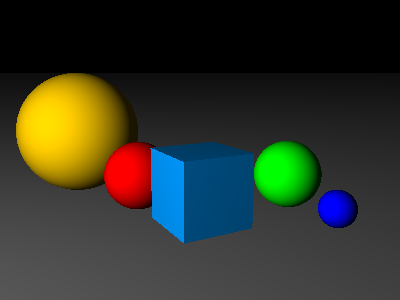

We're going to add support for two new shapes to our ray-tracer.

### Plane

A plane is an infinite flat shape. A plane has no thickness; it's a boundary that divides the world in half, with half of the world being "inside" the plane and the other half being "outside". To create a plane, we specify the **normal** direction (i.e. if we were standing on the plane, which way would be "up"), and the distance from the origin measured along that normal.

For example, to create an infinite "floor" in our scene, we create a new plane whose normal vector is `<0,1,0>` (i.e. straight up), at a distance of `0` from the origin.

Here's the code for the plane:

```javascript
// modules/shapes/plane.js


```

### Box

We're also going to add a box - a rectangular box defined by two opposite corners.

> For now, boxes will always be aligned with the x/y/z axes; we'll look at how to rotate shapes later in the workshop.

The box is actually pretty simple, but most operations have to be repeated three times -- once for each axis. 

> There is an excellent interactive visualisation of the intersection algorithm used for boxes at graphicscompendium.com: 
>
> [https://graphicscompendium.com/raytracing/16-boxes](https://graphicscompendium.com/raytracing/16-boxes)

Here's the code for the box:

```javascript
// modules/shapes/box.js


```

### A scene with more shapes

Now modify `main.js` to add a plane and a box to our scene:

```javascript
// main.js


```

Reload the browser, and you should see something like this:



Nice. Except... it's kinda hard to tell whether the shapes are floating in space or resting on the plane, right? That's because none of our shapes is casting any shadows. We'll add shadows in the next section.
