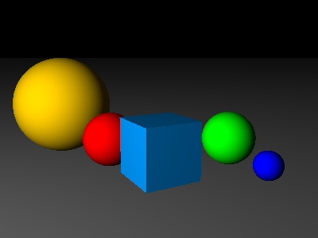
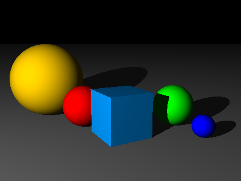

At the end of the last section, our scene looked like this:



We're going to add support for shadows, so that shapes will cast shadows, and areas that are in shadow won't be illuminated by the associated light source.

All this happens inside the `Shape` class - in fact, we only need to modify the `getColorAt` method. 

Here's `shape.js` with the modified method in place:

```javascript
// modules/shape.js


```

What we do here is, for each point on the shape's surface, we trace a ray from that point to the light source, and check whether that ray intersects any other shapes along the way. If it does, then we're in that shape's shadow, and so we should skip that light source when calculating how much light falls on this shape.

Compare the result below with the original image above:




