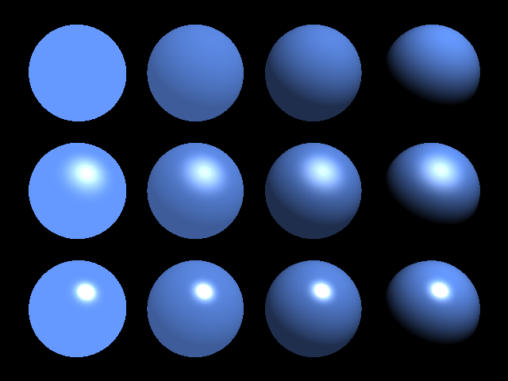
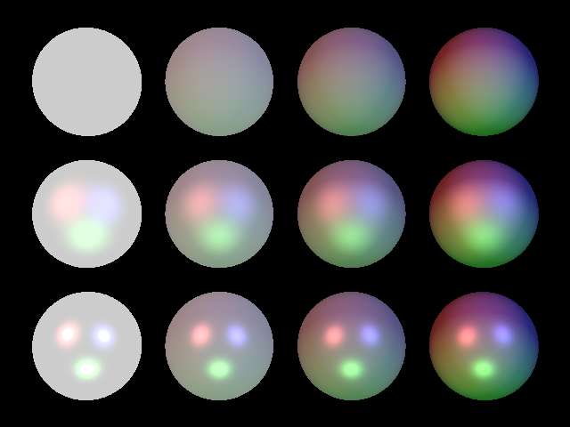

Time to introduce some more terminology. The color of a shape in our tracer scene is actually controlled by a bunch of different parameters

* **ambient** color is how much of the shape's underlying color is visible, even when it isn't directly illuminated. Ambient lighting is a bit of a hack; in the real world, especially in daylight, there's so much reflected sunlight and artificial light bouncing around that we can see what color objects are even if they're not being directly illuminated. Calculating those kinds of lighting effects in a tracer is prohibitively difficult, though, so if we need it, we fake it by adding a bit of ambient color to the object's appearance.
* **diffuse** color is how strongly the shape reacts to direct light sources.
* **specular** highlights are the bright shiny spots we get when a light source reflects in the surface of a smooth curved object.

The spheres in this image are all made from the same material -- they're the same *color* -- but you can see how ambient, diffuse, and specular lighting affect their appearance.



To use these optical properties in our scenes, we need to add a new property to our shapes. Until now, everything in our world has been a solid color; now we're going to introduce the idea of a texture.

A texture has two parts:

* the **material** -- what's the object actually made of? 
* the **finish** -- how shiny is it? Does it have highlights?

We're going to introduce two new classes here, `texture.js` and `finish.js`:

```javascript
// modules/texture.js


```

```javascript
//modules/finish.js


```

When we create shapes in a scene, we now have the ability to specify a finish as well as a color:

```javascript
let shinyRed = new Texture(
   new Color(255,0,0),
   new Finish({ambient: 0.1, diffuse: 0.6, specular: 0.9})
};

let shinyRedBall = new Sphere(
	Vector.X 	// centre,
	1 			// radius,
	shinyRed 	// texture
);
```

Now we need to update our `Shape.getColorAt` method to take these new properties into account.

First, we'll add a method to calculate the **reflection direction** at a specific point -- i.e. if a ray of light hits our shape at a certain point, which way is it going to "bounce"?

 ```javascript
 // add this method to modules/shape.js
 
 reflect = (incident, normal) => {
     let inverse = incident.invert();
     return inverse.add(normal.scale(normal.dot(inverse)).add(incident).scale(2));
 }
 ```

Now, we'll modify `getColorAt` to calculate ambient, diffuse, and specular lighting effects for each point on the surface of our object. We're changing four things here

1. The `getColorAt` method now needs the `Ray` as an argument, because we can't calculate lighting effects unless we know which direction the light came from.
2. The ambient color is now calculated based on `this.material.finish.ambient` - previously we just used a global `AMBIENT` constant for this.
3. The amount of light contributed by a light source is multiplied by `this.material.finish.diffuse`, so that objects with a diffuse value close to zero aren't strongly affected by light sources, and objects with a diffuse value close to one will react strongly to light sources.
4. We take the dot-product of the `reflex` vector and the `lightDirection` vector; if it's greater than zero, we add a specular highlight (a "shiny spot") to the surface of the object. 

The actual amount of specular highlighting is given by this formula:

```javascript
let exponent = 16 * this.material.finish.specular * this.material.finish.specular;
specular = Math.pow(specular, exponent);
```

Yes, that's raising it to the power of 16. That's what produces the sharp drop-off effect around the specular highlight.

Here's the modifed `shape.js` with the ambient, diffuse and specular calculations included:

```javascript
// modules/shape.js


```

Check out the [live demo for this section](examples/08-highlights/index.html) to see two examples of lighting effects in action; one is the code used to draw the image above; the other shows how white spheres react to coloured lights:



