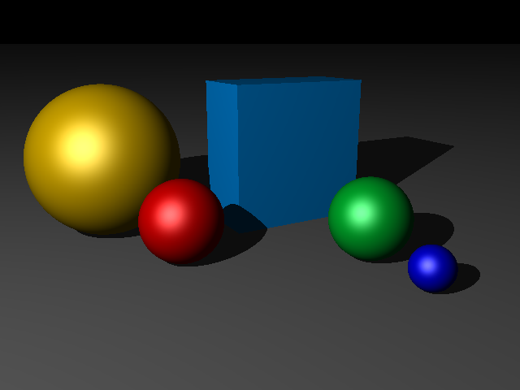

We're closing in on the classic ray-tracer demo image - a mirrored sphere resting on a chessboard. There's only two things missing... we can't do mirrors, and we can't do chessboards. 

Let's start by adding reflection support. Here's the scene we're going to use:



First, we need to add another property to our `Finish` class, which controls how reflective a shape is. A finish with `reflection==1` is a perfect mirror; a finish with `reflection == 0` doesn't reflect at all.

```javascript
// modules/finish.js


```

### Reflection, recursion, and MAX_DEPTH

We're going to add reflection support by using recursion -- whenever a ray reflects from a shape, that effectively runs a whole fresh trace to figure out what the "reflected" scene looks like, and then adds that the the result of the original trace.

If you've ever stood between two parallel mirrors, you've seen this kind of recursion happening in real life... and if they were optically perfect mirrors in a vacuum, you'd get infinite reflections. But computers don't really like doing infinite things. So to stop our renderer disappearing into an infinite loop, we need to put a limit on how many times a ray will reflect before we give up and assume what we've got by now is good enough.

We're going to add a MAX_DEPTH to our `settings.js` module, and then pass a `depth` parameter to the `Ray.trace` method; each time we recursively trace a ray, we'll increment the `depth`, and if `depth > MAX_DEPTH`, we bail out.

> If you find scenes are taking too long to render, decrease`MAX_DEPTH`. If you find you're getting weird optical artefacts and blank areas where there should be reflections, increase `MAX_DEPTH` (and be prepared to wait a long time for your images to render!)

`Ray.trace` should now pass the `depth` parameter to `getColorAt`; here's the updated code:

```javascript
// modules/ray.js


```

Finally, we need to add a snippet of code to `shape.js` so that if a shape has a non-zero reflection, it'll create a new ray, bounce that ray off into the scene to see what else it hits, calculate the reflected color, and add that to the returned color:

```javascript
let reflectionAmount = this.texture.finish.reflection;
if (reflectionAmount) {
    let reflectionRay = new Ray(point, reflex);
    let reflectedColor = reflectionRay.trace(scene, depth);
    colorToReturn = colorToReturn.add(reflectedColor.scale(reflectionAmount));
}
```

That's it. Here's the same scene rendered with every shape set to `reflection = 0.5`:


