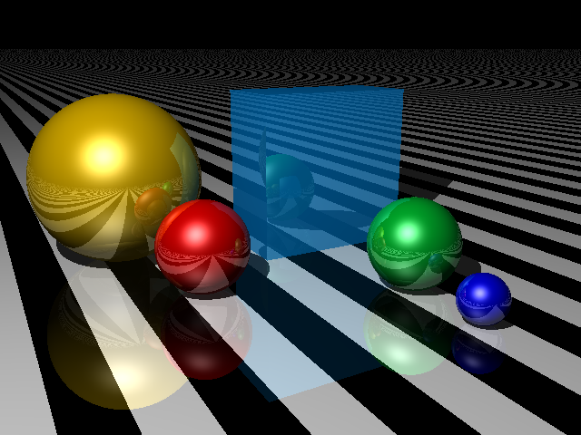
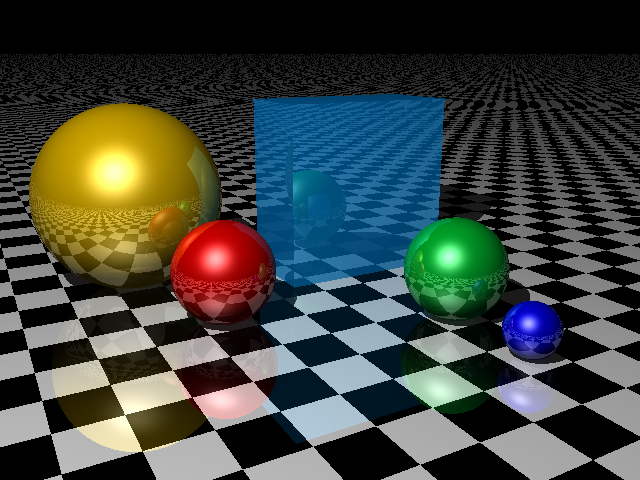
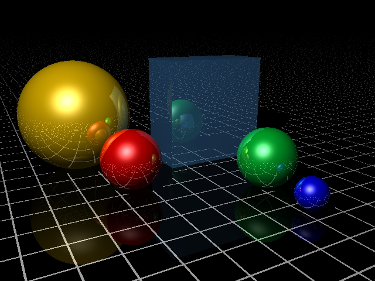

Until now, every shape in our world is a single solid color. In this section, we'll see how to create different kinds of materials so we can create objects with patterned finishes, like stripes, rings, and the obligatory checkerboard pattern.

A pattern works by extending `Material` and returning different colors for different points, depending on those points' coordinates.

### Stripes

First, we'll create a striped pattern. Stripes are exactly 1 unit wide, and run parallel to the Z-axis; to create a stripe pattern, we specify two colors. 

```javascript
// modules/patterns/stripes.js


```

To create a striped shape, we pass a `new Stripes` into the `Texture` constructor:

```javascript
var plane = new Plane(
	Vector.Y, 
	0, 
	new Texture(
		new Stripes(Color.Black, Color.White), 
		new Finish({reflection: 0.1, diffuse: 0.7, ambient: 0.1 })
	}
);
```



### Chessboard

The chessboard pattern uses the same principle as stripes, but we need to look at both the `x` and `z` coordinates to decide which color to return.

```javascript
// modules/patterns/chessboard.js


```

As with `Stripes`, we need to specify two colors when creating a `Chessboard` pattern:

```javascript
var plane = new Plane(
	Vector.Y, 
	0, 
	new Texture(
		new Chessboard(Color.Black, Color.White), 
		new Finish({reflection: 0.1, diffuse: 0.7, ambient: 0.1 })
	}
);
```



### Tiles

Tiles render as a repeating pattern of rectangular blocks surrounded by a uniform gap. To create tiles, we specify the width, depth and height of a single brick, the thickness of the mortar between the tiles, and the colors of the tiles and the "mortar" that fills the gaps:

```javascript
// modules/patterns/tiles.js


```

Here's a tiles pattern used as a floor in our reflection example:

```javascript
let tiles = new Texture(
	new Tiles(new Vector(1, 1, 1), 0.05, Color.Black, new Color("#fff")),
	new Finish({ ambient: 0, diffuse: 0.7, reflection: 0.2 })
)
```




